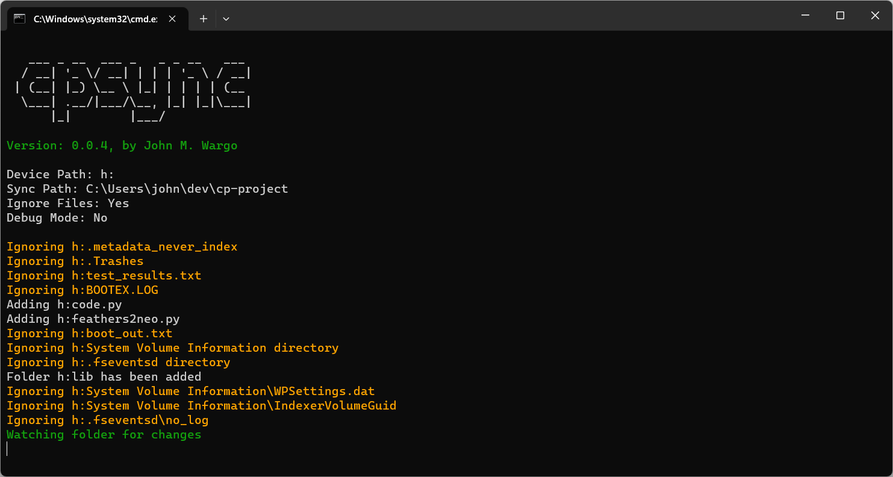

# CircuitPython Sync

Node module that synchronizes the files on a connected CircuitPython device to a local project folder.


## Usage

To install globally, open a command prompt or terminal window and execute the following command:

``` shell
npm install -g circuitpython-sync
```

Once you've installed the module, to start the sync process, in a terminal window execute the following command:

``` shell
cpsync <device_path> <sync_path>
```

where:

* `<device_path>` is the drive path for a connected CircuitPython device
* `<sync_path>` is the local project folder where you want the module to copy the files from the connected CircuitPython device

Both parameters are required.

If you don't want to install it globally, you can execute the module on the fly using:

``` shell
npx cpsync <device_path> <sync_path>
```

I like to execute the module from the terminal prompt in Visual Studio Code, but keep the terminal available to execute other commands, so I start the module using the following:

``` shell
start cpsync <device_path> <sync_path>
```

On macOS and, I think, Linux, use the following:

``` shell
open cpsync <device_path> <sync_path>
```

This starts the module in a separate terminal window, leaving the Visual Studio terminal available to me to execute additional commands.  For example, if I execute the following command:

``` shell
start cpsync h: .
```

A new window opens as shown in the following figure



The CircuitPython device shows up as drive H: and the . tells the module to copy the files to the current folder.

Every time you change the file contents on the device, the module copies the modified files to the local project folder.

